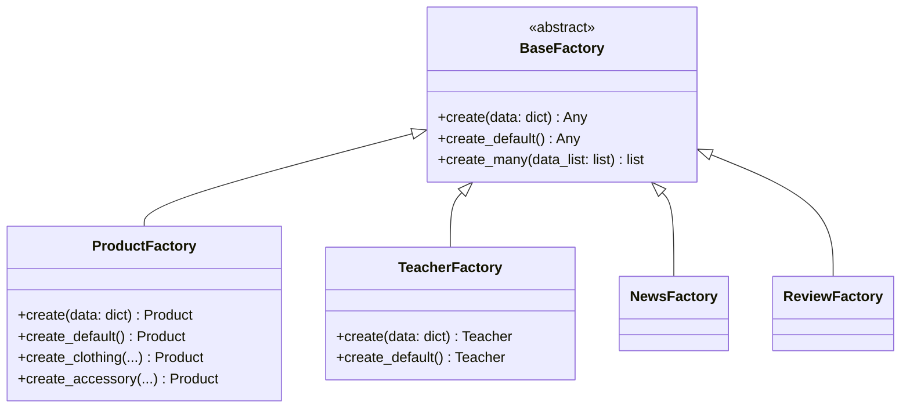
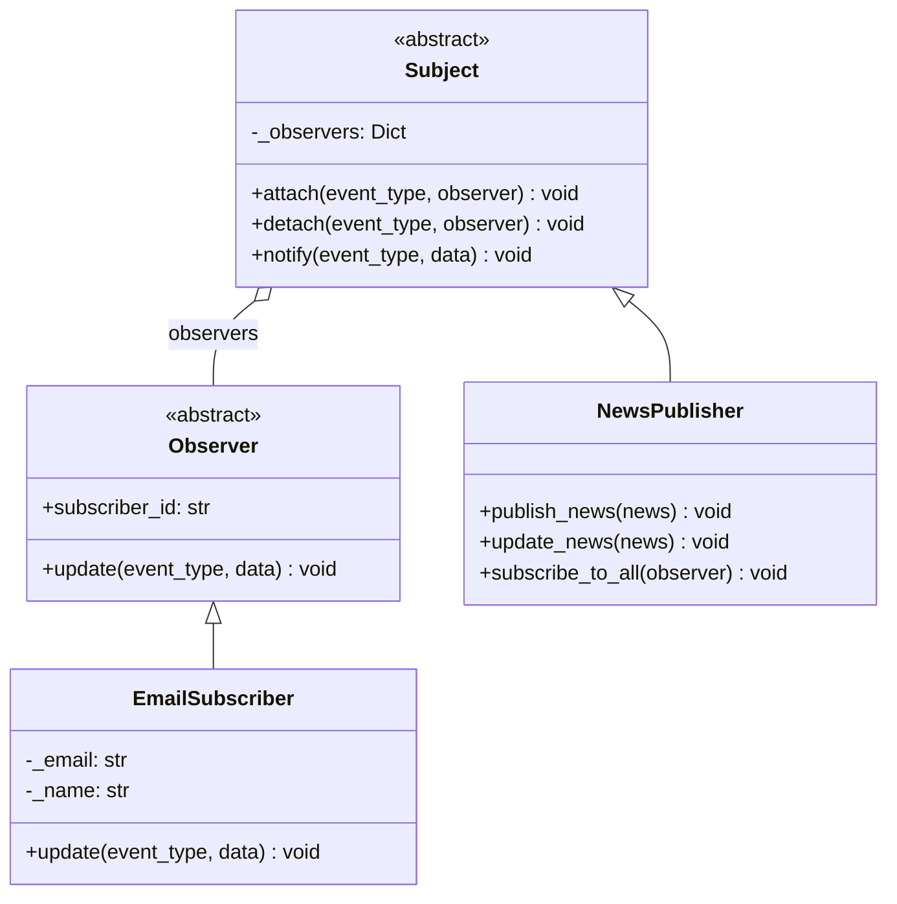
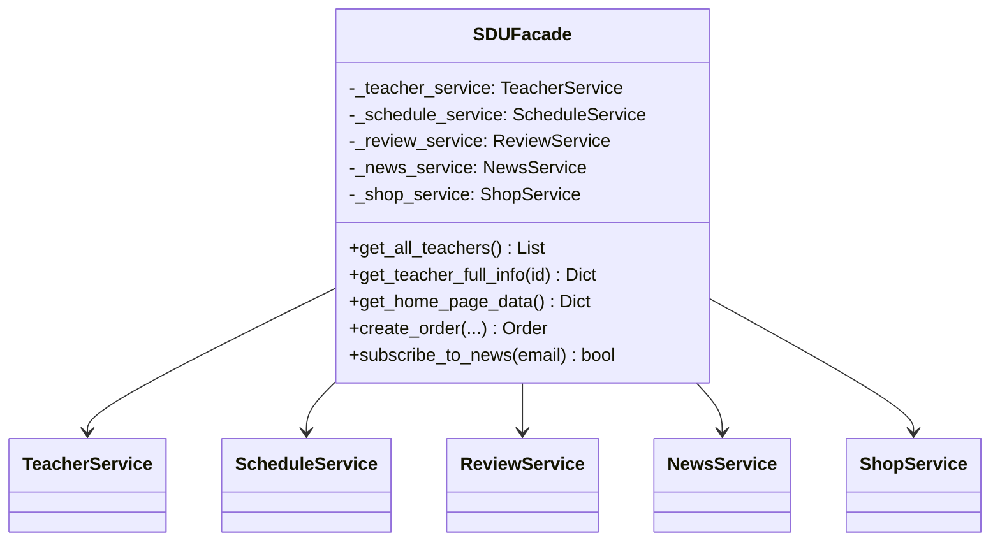

# Design Patterns in SDU SuperApp

## Project Overview

SDU SuperApp uses **4 design patterns**:

| Pattern | Type | Where Used |
|---------|------|------------|
| **Facade** | Structural | Single access point to all services |
| **Factory Method** | Creational | Object creation (Product, News, Teacher, Review) |
| **Observer** | Behavioral | Subscriber notifications about news |
| **Singleton** | Creational | Single instance of Facade and Publisher |

---

## 1. Factory Method Pattern (Creational)

### Description
Defines an interface for creating objects, but lets subclasses decide which class to instantiate.

### Diagram


### Abstract Factory

```python
# factory/base_factory.py
from abc import ABC, abstractmethod
from typing import Any

class BaseFactory(ABC):
    """
    Abstract Factory - defines interface for creating objects.
    
    SOLID principles:
    - SRP: Factory is responsible only for object creation
    - OCP: New factories can be added without changing existing ones
    - LSP: All factories implement a single interface
    - DIP: Depends on abstraction, not concrete classes
    """

    @abstractmethod
    def create(self, data: dict) -> Any:
        """Factory method - creates object from data dictionary."""
        pass

    @abstractmethod
    def create_default(self) -> Any:
        """Creates object with default values."""
        pass

    def create_many(self, data_list: list) -> list:
        """Creates multiple objects from list of dictionaries."""
        return [self.create(data) for data in data_list]
```

### Concrete Factory

```python
# factory/product_factory.py
import uuid
from factory.base_factory import BaseFactory
from models.product import Product

class ProductFactory(BaseFactory):
    """Factory for creating Product objects."""

    def create(self, data: dict) -> Product:
        """Creates product from data dictionary."""
        if 'id' not in data or not data['id']:
            data['id'] = str(uuid.uuid4())
        return Product.from_dict(data)

    def create_default(self) -> Product:
        """Creates product with default values."""
        return Product(
            id=str(uuid.uuid4()),
            name="New Product",
            description="",
            price=0.0,
            category="Other",
            stock=0,
            is_available=False
        )

    def create_clothing(self, name: str, description: str, 
                        price: float, stock: int) -> Product:
        """Creates clothing product."""
        return Product(
            id=str(uuid.uuid4()),
            name=name,
            description=description,
            price=price,
            category="Clothing",
            stock=stock,
            is_available=stock > 0
        )
```

---

## 2. Observer Pattern (Behavioral)

### Description
Defines a one-to-many dependency between objects. When one object changes state, all its dependents are notified and updated automatically.

### Diagram


### Observer Interface

```python
# observer/observer.py
from abc import ABC, abstractmethod
from typing import Any

class Observer(ABC):
    """
    Abstract observer.
    
    SOLID principles:
    - SRP: Observer is responsible only for receiving notifications
    - ISP: Minimal interface with one method
    - DIP: Depends on abstraction
    """

    @abstractmethod
    def update(self, event_type: str, data: Any) -> None:
        """
        Called by Subject when event occurs.
        
        Args:
            event_type: Event type ('news_created', 'news_updated')
            data: Event data (e.g., News object)
        """
        pass

    @property
    @abstractmethod
    def subscriber_id(self) -> str:
        """Unique subscriber identifier."""
        pass
```

### Subject (Publisher)

```python
# observer/subject.py
from abc import ABC
from typing import List, Dict, Any
from observer.observer import Observer

class Subject(ABC):
    """Abstract Subject (Publisher)."""

    def __init__(self):
        self._observers: Dict[str, List[Observer]] = {}

    def attach(self, event_type: str, observer: Observer) -> None:
        """Subscribes observer to specific event type."""
        if event_type not in self._observers:
            self._observers[event_type] = []
        
        # Check for duplicate subscription
        for obs in self._observers[event_type]:
            if obs.subscriber_id == observer.subscriber_id:
                return
        
        self._observers[event_type].append(observer)

    def detach(self, event_type: str, observer: Observer) -> None:
        """Unsubscribes observer from event."""
        if event_type in self._observers:
            self._observers[event_type] = [
                obs for obs in self._observers[event_type]
                if obs.subscriber_id != observer.subscriber_id
            ]

    def notify(self, event_type: str, data: Any) -> None:
        """Notifies all subscribers about event."""
        if event_type not in self._observers:
            return
        
        for observer in self._observers[event_type]:
            observer.update(event_type, data)
```

### Concrete Observer

```python
# observer/email_subscriber.py
from observer.observer import Observer

class EmailSubscriber(Observer):
    """Email notification subscriber."""

    def __init__(self, subscriber_id: str, email: str, 
                 name: str, language: str = 'en'):
        self._subscriber_id = subscriber_id
        self._email = email
        self._name = name
        self._language = language

    @property
    def subscriber_id(self) -> str:
        return self._subscriber_id

    def update(self, event_type: str, data: Any) -> None:
        """Handles event notification."""
        if event_type == 'news_created':
            self._send_email(
                subject=f'🆕 New article: {data.title}',
                body=f'Hello, {self._name}!\n'
                     f'New article published: "{data.title}"'
            )
```

---

## 3. Facade Pattern (Structural)

### Description
Provides a unified interface to a set of interfaces in a subsystem. Makes the subsystem easier to use.

### Diagram


### Facade

```python
# facade/sdu_facade.py
from services.teacher_service import TeacherService
from services.schedule_service import ScheduleService
from services.review_service import ReviewService
from services.news_service import NewsService
from services.shop_service import ShopService

class SDUFacade:
    """
    SDU SuperApp Facade.
    
    Provides a single interface for all application functions.
    Hides complexity of internal structure from client code.
    
    Facade pattern advantages:
    1. Simplifies usage of complex system
    2. Reduces coupling between client and subsystems
    3. Provides single entry point
    """

    _instance = None  # Singleton

    def __new__(cls):
        """Singleton - single facade instance."""
        if cls._instance is None:
            cls._instance = super().__new__(cls)
            cls._instance._initialized = False
        return cls._instance

    def __init__(self):
        if self._initialized:
            return
        
        self._teacher_service = TeacherService()
        self._schedule_service = ScheduleService()
        self._review_service = ReviewService()
        self._news_service = NewsService()
        self._shop_service = ShopService()
        self._initialized = True

    # === Complex Operations ===
    
    def get_teacher_full_info(self, teacher_id: str) -> dict:
        """
        Returns complete teacher information:
        - Teacher data
        - Schedule
        - Reviews
        - Rating
        """
        teacher = self._teacher_service.get_teacher_by_id(teacher_id)
        if not teacher:
            return None
        
        return {
            'teacher': teacher,
            'schedule': self._schedule_service.get_teacher_schedule(teacher_id),
            'reviews': self._review_service.get_teacher_reviews(teacher_id),
            'rating': self._review_service.get_teacher_rating(teacher_id)
        }

    def get_home_page_data(self) -> dict:
        """Returns data for home page."""
        return {
            'top_teachers': self._teacher_service.get_top_rated_teachers(5),
            'latest_news': self._news_service.get_all_news(5),
            'popular_news': self._news_service.get_popular_news(3),
            'products': self._shop_service.get_all_products()[:6]
        }
```

---

## 4. Singleton Pattern (Creational)

### Description
Ensures a class has only one instance and provides a global point of access to it.

### Where Used in Project

1. **SDUFacade** - single facade instance
2. **NewsPublisher** - single news publisher instance

### Implementation

```python
# In SDUFacade and NewsPublisher

class SDUFacade:
    _instance = None

    def __new__(cls):
        """Singleton - single facade instance."""
        if cls._instance is None:
            cls._instance = super().__new__(cls)
            cls._instance._initialized = False
        return cls._instance

    def __init__(self):
        if self._initialized:
            return
        # Initialize services...
        self._initialized = True


class NewsPublisher(Subject):
    _instance = None

    def __new__(cls):
        """Singleton - single publisher instance."""
        if cls._instance is None:
            cls._instance = super().__new__(cls)
            cls._instance._initialized = False
        return cls._instance
```

---

## Project Structure

```
SduSuperApp/
├── facade/
│   └── sdu_facade.py          # Facade + Singleton Pattern
├── factory/
│   ├── base_factory.py        # Abstract Factory
│   ├── product_factory.py     # Factory Method
│   ├── news_factory.py        # Factory Method
│   ├── teacher_factory.py     # Factory Method
│   └── review_factory.py      # Factory Method
├── observer/
│   ├── observer.py            # Observer Interface
│   ├── subject.py             # Base Subject
│   ├── email_subscriber.py    # Concrete Observer
│   └── news_publisher.py      # Concrete Subject + Singleton
├── repository/                # Data Access Layer
├── services/                  # Business Logic
├── controllers/               # MVC Controllers
└── models/                    # Data Models
```

---

## SOLID Principles in Project

| Principle | Implementation |
|-----------|----------------|
| **SRP** | Each class has single responsibility |
| **OCP** | New factories can be added without changing existing ones |
| **LSP** | All factories are interchangeable |
| **ISP** | Minimal interfaces (Observer) |
| **DIP** | Services depend on abstractions (BaseFactory) |
