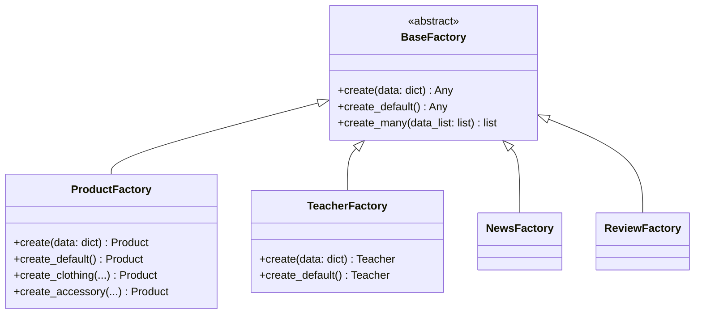
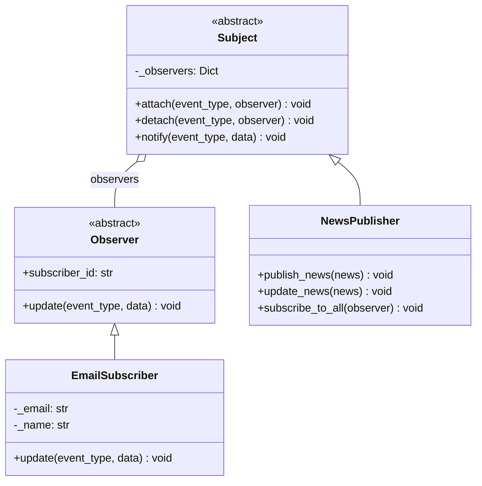
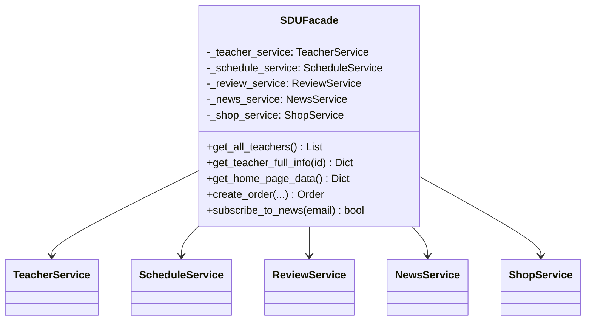

# Паттерны Проектирования в SDU SuperApp

## Обзор проекта

SDU SuperApp использует **4 паттерна проектирования**:

| Паттерн | Тип | Где используется |
|---------|-----|------------------|
| **Facade** | Структурный | Единая точка доступа ко всем сервисам |
| **Factory Method** | Порождающий | Создание объектов (Product, News, Teacher, Review) |
| **Observer** | Поведенческий | Уведомления подписчиков о новостях |
| **Singleton** | Порождающий | Единственный экземпляр Facade и Publisher |

---

## 1. Паттерн Factory Method (Порождающий)

### Описание
Определяет интерфейс для создания объектов, но позволяет подклассам решать, какой класс инстанцировать.

### Диаграмма


### Абстрактная фабрика

```python
# factory/base_factory.py
from abc import ABC, abstractmethod
from typing import Any

class BaseFactory(ABC):
    """
    Абстрактная Фабрика - определяет интерфейс для создания объектов.
    
    SOLID принципы:
    - SRP: Фабрика отвечает только за создание объектов
    - OCP: Можно добавлять новые фабрики без изменения существующих
    - LSP: Все фабрики реализуют единый интерфейс
    - DIP: Зависит от абстракции, а не от конкретных классов
    """

    @abstractmethod
    def create(self, data: dict) -> Any:
        """Фабричный метод - создаёт объект из словаря данных."""
        pass

    @abstractmethod
    def create_default(self) -> Any:
        """Создаёт объект со значениями по умолчанию."""
        pass

    def create_many(self, data_list: list) -> list:
        """Создаёт несколько объектов из списка словарей."""
        return [self.create(data) for data in data_list]
```

### Конкретная фабрика

```python
# factory/product_factory.py
import uuid
from factory.base_factory import BaseFactory
from models.product import Product

class ProductFactory(BaseFactory):
    """Фабрика для создания объектов Product."""

    def create(self, data: dict) -> Product:
        """Создаёт продукт из словаря данных."""
        if 'id' not in data or not data['id']:
            data['id'] = str(uuid.uuid4())
        return Product.from_dict(data)

    def create_default(self) -> Product:
        """Создаёт продукт со значениями по умолчанию."""
        return Product(
            id=str(uuid.uuid4()),
            name="New Product",
            description="",
            price=0.0,
            category="Other",
            stock=0,
            is_available=False
        )

    def create_clothing(self, name: str, description: str, 
                        price: float, stock: int) -> Product:
        """Создаёт товар категории 'Одежда'."""
        return Product(
            id=str(uuid.uuid4()),
            name=name,
            description=description,
            price=price,
            category="Clothing",
            stock=stock,
            is_available=stock > 0
        )
```

---

## 2. Паттерн Observer (Поведенческий)

### Описание
Определяет зависимость "один-ко-многим" между объектами. Когда объект изменяется, все зависимые объекты уведомляются автоматически.

### Диаграмма


### Интерфейс Observer

```python
# observer/observer.py
from abc import ABC, abstractmethod
from typing import Any

class Observer(ABC):
    """
    Абстрактный наблюдатель.
    
    SOLID принципы:
    - SRP: Observer отвечает только за получение уведомлений
    - ISP: Минимальный интерфейс с одним методом
    - DIP: Зависит от абстракции
    """

    @abstractmethod
    def update(self, event_type: str, data: Any) -> None:
        """
        Вызывается Subject при возникновении события.
        
        Args:
            event_type: Тип события ('news_created', 'news_updated')
            data: Данные события (например, объект News)
        """
        pass

    @property
    @abstractmethod
    def subscriber_id(self) -> str:
        """Уникальный идентификатор подписчика."""
        pass
```

### Subject (Publisher)

```python
# observer/subject.py
from abc import ABC
from typing import List, Dict, Any
from observer.observer import Observer

class Subject(ABC):
    """Абстрактный Subject (Издатель)."""

    def __init__(self):
        self._observers: Dict[str, List[Observer]] = {}

    def attach(self, event_type: str, observer: Observer) -> None:
        """Подписывает наблюдателя на определённый тип события."""
        if event_type not in self._observers:
            self._observers[event_type] = []
        
        # Проверка на повторную подписку
        for obs in self._observers[event_type]:
            if obs.subscriber_id == observer.subscriber_id:
                return
        
        self._observers[event_type].append(observer)

    def detach(self, event_type: str, observer: Observer) -> None:
        """Отписывает наблюдателя от события."""
        if event_type in self._observers:
            self._observers[event_type] = [
                obs for obs in self._observers[event_type]
                if obs.subscriber_id != observer.subscriber_id
            ]

    def notify(self, event_type: str, data: Any) -> None:
        """Уведомляет всех подписчиков о событии."""
        if event_type not in self._observers:
            return
        
        for observer in self._observers[event_type]:
            observer.update(event_type, data)
```

### Конкретный Observer

```python
# observer/email_subscriber.py
from observer.observer import Observer

class EmailSubscriber(Observer):
    """Email-подписчик на уведомления."""

    def __init__(self, subscriber_id: str, email: str, 
                 name: str, language: str = 'ru'):
        self._subscriber_id = subscriber_id
        self._email = email
        self._name = name
        self._language = language

    @property
    def subscriber_id(self) -> str:
        return self._subscriber_id

    def update(self, event_type: str, data: Any) -> None:
        """Обрабатывает уведомление о событии."""
        if event_type == 'news_created':
            self._send_email(
                subject=f'🆕 Новая новость: {data.title}',
                body=f'Здравствуйте, {self._name}!\n'
                     f'Опубликована новая статья: "{data.title}"'
            )
```

---

## 3. Паттерн Facade (Структурный)

### Описание
Предоставляет унифицированный интерфейс к набору интерфейсов подсистемы. Упрощает использование сложной системы.

### Диаграмма


### Facade

```python
# facade/sdu_facade.py
from services.teacher_service import TeacherService
from services.schedule_service import ScheduleService
from services.review_service import ReviewService
from services.news_service import NewsService
from services.shop_service import ShopService

class SDUFacade:
    """
    SDU SuperApp Фасад.
    
    Предоставляет единый интерфейс для всех функций приложения.
    Скрывает сложность внутренней структуры от клиентского кода.
    
    Преимущества паттерна Facade:
    1. Упрощает использование сложной системы
    2. Уменьшает связанность между клиентом и подсистемами
    3. Предоставляет единую точку входа
    """

    _instance = None  # Singleton

    def __new__(cls):
        """Singleton - один экземпляр фасада."""
        if cls._instance is None:
            cls._instance = super().__new__(cls)
            cls._instance._initialized = False
        return cls._instance

    def __init__(self):
        if self._initialized:
            return
        
        self._teacher_service = TeacherService()
        self._schedule_service = ScheduleService()
        self._review_service = ReviewService()
        self._news_service = NewsService()
        self._shop_service = ShopService()
        self._initialized = True

    # === Сложные операции ===
    
    def get_teacher_full_info(self, teacher_id: str) -> dict:
        """
        Возвращает полную информацию о преподавателе:
        - Данные преподавателя
        - Расписание
        - Отзывы
        - Рейтинг
        """
        teacher = self._teacher_service.get_teacher_by_id(teacher_id)
        if not teacher:
            return None
        
        return {
            'teacher': teacher,
            'schedule': self._schedule_service.get_teacher_schedule(teacher_id),
            'reviews': self._review_service.get_teacher_reviews(teacher_id),
            'rating': self._review_service.get_teacher_rating(teacher_id)
        }

    def get_home_page_data(self) -> dict:
        """Возвращает данные для главной страницы."""
        return {
            'top_teachers': self._teacher_service.get_top_rated_teachers(5),
            'latest_news': self._news_service.get_all_news(5),
            'popular_news': self._news_service.get_popular_news(3),
            'products': self._shop_service.get_all_products()[:6]
        }
```

---

## 4. Паттерн Singleton (Порождающий)

### Описание
Гарантирует, что класс имеет только один экземпляр, и предоставляет глобальную точку доступа к нему.

### Где используется в проекте

1. **SDUFacade** - единственный экземпляр фасада
2. **NewsPublisher** - единственный издатель новостей

### Реализация

```python
# В SDUFacade и NewsPublisher

class SDUFacade:
    _instance = None

    def __new__(cls):
        """Singleton - один экземпляр фасада."""
        if cls._instance is None:
            cls._instance = super().__new__(cls)
            cls._instance._initialized = False
        return cls._instance

    def __init__(self):
        if self._initialized:
            return
        # Инициализация сервисов...
        self._initialized = True


class NewsPublisher(Subject):
    _instance = None

    def __new__(cls):
        """Singleton - единственный экземпляр издателя."""
        if cls._instance is None:
            cls._instance = super().__new__(cls)
            cls._instance._initialized = False
        return cls._instance
```

---

## Структура проекта

```
SduSuperApp/
├── facade/
│   └── sdu_facade.py          # Паттерн Facade + Singleton
├── factory/
│   ├── base_factory.py        # Абстрактная фабрика
│   ├── product_factory.py     # Factory Method
│   ├── news_factory.py        # Factory Method
│   ├── teacher_factory.py     # Factory Method
│   └── review_factory.py      # Factory Method
├── observer/
│   ├── observer.py            # Интерфейс Observer
│   ├── subject.py             # Базовый Subject
│   ├── email_subscriber.py    # Конкретный Observer
│   └── news_publisher.py      # Конкретный Subject + Singleton
├── repository/                # Слой доступа к данным
├── services/                  # Бизнес-логика
├── controllers/               # MVC контроллеры
└── models/                    # Модели данных
```

---

## SOLID Принципы в проекте

| Принцип | Реализация |
|---------|------------|
| **SRP** | Каждый класс имеет одну ответственность |
| **OCP** | Можно добавлять новые фабрики без изменения существующих |
| **LSP** | Все фабрики взаимозаменяемы |
| **ISP** | Минимальные интерфейсы (Observer) |
| **DIP** | Сервисы зависят от абстракций (BaseFactory) |
