# 📚 SDU SuperApp — Complete Project Documentation

**Web Platform for SDU Students and Teachers**

CSS 217 – Software Architecture and Design Patterns  
Final Project | 2025

---

## 📋 Content

1. [General Description](#general-description)
2. [Technologies](#technologies)
3. [Project Architecture](#project-architecture)
4. [Design Patterns](#design-patterns)
5. [File Structure](#file-structure)
6. [Models Layer](#models-layer)
7. [Repositories Layer](#repositories-layer)
8. [Services Layer](#services-layer)
9. [Controllers Layer](#controllers-layer)
10. [Functional Modules](#functional-modules)
11. [SOLID Principles](#solid-principles)
12. [Run Application](#run-application)

---

## 🎯 General Description

SDU SuperApp is a comprehensive web application for SDU University, combining several key functions:

| Module | Description |
|--------|-------------|
| 👨‍🏫 **Teachers** | Teachers rating, reviews, schedule |
| 🚪 **Rooms** | Finding free classrooms in real-time |
| 📰 **News** | University news with subscription notifications |
| 🛒 **Shop** | SDU merch with cart and checkout |
| ⚙️ **Admin Panel** | Content management and moderation |

---

## 🛠 Technologies

```
Backend:       Python 3.11 + Flask 3.0
Frontend:      HTML5, CSS3, Jinja2
Storage:       JSON files (no database)
Icons:         Font Awesome 6
Fonts:         Google Fonts (Inter)
i18n:          Support for ru/en/kz languages
Email:         Automatic notifications
Translation:   deep-translator (auto-translation of products and news)
```

---

## 🏗 Project Architecture

The project uses a **multi-layer architecture** with clear separation of concerns:

```mermaid
flowchart TB
    subgraph Presentation["🖥️ Presentation Layer"]
        Templates[Jinja2 Templates]
        Static[CSS/JS/Images]
    end
    
    subgraph Controllers["🎮 Controllers Layer"]
        MainCtrl[main_controller]
        TeacherCtrl[teacher_controller]
        NewsCtrl[news_controller]
        ShopCtrl[shop_controller]
        RoomCtrl[room_controller]
        AdminCtrl[admin_controller]
    end
    
    subgraph Business["⚙️ Business Logic Layer"]
        Facade[SDUFacade - Single Entry Point]
        Services[Services - Business Logic]
        Observer[Observer - Notifications]
        Factory[Factory - Object Creation]
    end
    
    subgraph Data["💾 Data Access Layer"]
        Repositories[Repositories - CRUD Operations]
        Models[Models - Entities]
        JSON[JSON Files - Data Storage]
    end
    
    Templates --> Controllers
    Controllers --> Facade
    Facade --> Services
    Services --> Observer
    Services --> Factory
    Services --> Repositories
    Repositories --> Models
    Repositories --> JSON
```



---

## 🎨 Design Patterns

### 1. Factory Method (Creational Pattern)

**Location:** `factory/`

**Goal:** Defines an interface for creating objects, allowing subclasses to decide which class to instantiate.

```python
# factory/base_factory.py - Abstract Factory
class BaseFactory(ABC):
    @abstractmethod
    def create(self, data: dict) -> Any:
        """Creates an object from a data dictionary"""
        pass
    
    @abstractmethod
    def create_default(self) -> Any:
        """Creates an object with default values"""
        pass
```

**Concrete Factories:**
- `TeacherFactory` — creating teachers
- `NewsFactory` — creating news
- `ProductFactory` — creating products
- `ReviewFactory` — creating reviews

**Usage Example:**
```python
factory = TeacherFactory()
teacher = factory.create({
    'name': 'John Doe',
    'department': 'Computer Science',
    'level': 'Professor'
})
```

---

### 2. Observer (Behavioral Pattern)

**Location:** `observer/`

**Goal:** Defines a one-to-many dependency between objects. When the Subject changes, all Observers are notified automatically.


**How it works:**
1. User subscribes to news (email)
2. `EmailSubscriber` is created and registered in `NewsPublisher`
3. When news is published, all subscribers receive a notification
4. `EmailSubscriber` sends an email, `NotificationSubscriber` logs it

```python
# Usage Example
publisher = NewsPublisher()
subscriber = EmailSubscriber(id="sub_1", email="user@email.com", name="User")
publisher.subscribe_to_all(subscriber)

# When publishing — everyone will get a notification
publisher.publish_news(news)
```

---

### 3. Facade (Structural Pattern)

**Location:** `facade/sdu_facade.py`

**Goal:** Provides a unified interface to a set of interfaces in a subsystem, simplifying its usage.


**SDUFacade — single entry point:**
```python
class SDUFacade:
    """Singleton + Facade"""
    _instance = None
    
    def __init__(self):
        self._teacher_service = TeacherService()
        self._schedule_service = ScheduleService()
        self._review_service = ReviewService()
        self._cabinet_service = CabinetService()
        self._news_service = NewsService()
        self._shop_service = ShopService()
    
    # Complex operations
    def get_teacher_full_info(self, teacher_id):
        """Returns teacher + schedule + reviews + rating"""
        return {
            'teacher': self._teacher_service.get_teacher_by_id(teacher_id),
            'schedule': self._schedule_service.get_teacher_schedule(teacher_id),
            'reviews': self._review_service.get_teacher_reviews(teacher_id),
            'rating': self._review_service.get_teacher_rating(teacher_id)
        }
    
    def get_home_page_data(self):
        """Data for home page"""
        return {
            'top_teachers': self._teacher_service.get_top_rated_teachers(5),
            'latest_news': self._news_service.get_all_news(5),
            'products': self._shop_service.get_all_products()[:6]
        }
```

---

### 4. Singleton

Used in several classes to ensure a single instance:

- `SDUFacade` — single entry point to services
- `NewsPublisher` — single publisher of news

```python
class SDUFacade:
    _instance = None
    
    def __new__(cls):
        if cls._instance is None:
            cls._instance = super().__new__(cls)
            cls._instance._initialized = False
        return cls._instance
```

---

## 📁 File Structure

```
SduSuperApp/
├── app.py                      # Main Flask file
├── config.py                   # Application configuration
├── requirements.txt            # Python dependencies
│
├── models/                     # 📦 Data Models (Entities)
│   ├── teacher.py              # Teacher
│   ├── schedule.py             # Schedule
│   ├── review.py               # Review
│   ├── room.py                 # Room
│   ├── news.py                 # News
│   ├── product.py              # Product
│   ├── order.py                # Order
│   └── subscriber.py           # Email Subscriber
│
├── repository/                 # 💾 Repositories (Data Access)
│   ├── base_repository.py      # Base Repository
│   ├── teacher_repository.py
│   ├── schedule_repository.py
│   ├── review_repository.py
│   ├── room_repository.py
│   ├── news_repository.py
│   ├── product_repository.py
│   ├── order_repository.py
│   └── subscriber_repository.py
│
├── services/                   # ⚙️ Services (Business Logic)
│   ├── teacher_service.py
│   ├── schedule_service.py
│   ├── review_service.py
│   ├── room_service.py
│   ├── news_service.py
│   ├── shop_service.py
│   ├── email_service.py        # Email Sending
│   └── translation_service.py  # Content Auto-translation
│
├── controllers/                # 🎮 Controllers (Flask Blueprints)
│   ├── main_controller.py      # /
│   ├── teacher_controller.py   # /teachers
│   ├── review_controller.py    # /reviews
│   ├── room_controller.py      # /rooms
│   ├── news_controller.py      # /news
│   ├── shop_controller.py      # /shop
│   ├── admin_controller.py     # /admin
│   └── language_controller.py  # /lang
│
├── factory/                    # 🏭 Factory Method Pattern
│   ├── base_factory.py
│   ├── teacher_factory.py
│   ├── news_factory.py
│   ├── product_factory.py
│   └── review_factory.py
│
├── observer/                   # 👀 Observer Pattern
│   ├── observer.py             # Abstract Observer
│   ├── subject.py              # Abstract Subject
│   ├── news_publisher.py       # News Publisher
│   ├── email_subscriber.py     # Email Subscriber
│   └── notification_subscriber.py
│
├── facade/                     # 🎭 Facade Pattern
│   └── sdu_facade.py           # Single Entry Point
│
├── templates/                  # 🖼 HTML Templates (Jinja2)
│   ├── base.html               # Base Template
│   ├── index.html              # Main Page
│   ├── teachers/               # Teacher Pages
│   ├── rooms/                  # Room Pages
│   ├── news/                   # News Pages
│   ├── shop/                   # Shop Pages
│   └── admin/                  # Admin Panel
│
├── static/                     # 📁 Static Files
│   └── style.css
│
├── data/                       # 📊 JSON Data
│   ├── teachers.json
│   ├── schedules.json
│   ├── reviews.json
│   ├── rooms.json
│   ├── news.json
│   ├── products.json
│   ├── orders.json
│   └── subscribers.json
│
├── translations/               # 🌍 Translation Files (i18n)
│   ├── ru.json
│   ├── en.json
│   └── kz.json
│
└── utils/                      # 🔧 Utilities
    └── i18n.py                 # Internationalization Functions
```

---

## 📦 Models Layer

Models represent domain entities with dataclass typing:

### Teacher
```python
@dataclass
class Teacher:
    id: str
    name: str
    email: str
    department: str
    level: str              # Professor, Associate Professor, Senior Lecturer, Lecturer
    photo: str
    rating: float = 0.0
    reviews_count: int = 0
```

### News
```python
@dataclass
class News:
    id: str
    title: str
    content: str
    category: str           # Study, Events, Sports, Announcements
    author: str
    created_at: str
    image: str
    views: int = 0
    translations: Dict = field(default_factory=dict)  # Translations for en/kz
```

### Product
```python
@dataclass
class Product:
    id: str
    name: str
    description: str
    category: str
    price: float
    stock: int
    image: str
    is_available: bool = True
    translations: Dict = field(default_factory=dict)
```

### Order
```python
@dataclass
class Order:
    id: str
    customer_name: str
    customer_email: str
    items: List[Dict]       # [{'product_id', 'name', 'price', 'quantity'}]
    total_amount: float
    status: str             # Pending, Confirmed, Delivered, Cancelled
    created_at: str
    delivery_address: str
    language: str = 'ru'
```

---

## 💾 Repositories Layer

Repositories provide data access abstraction (CRUD operations):

### BaseRepository — base class
```python
class BaseRepository(ABC):
    def __init__(self, file_path: str, factory: BaseFactory):
        self._file_path = file_path
        self._factory = factory
    
    def get_all(self) -> List:
        """Get all records"""
        
    def get_by_id(self, id: str) -> Optional:
        """Get by ID"""
        
    def create(self, item) -> Any:
        """Create record"""
        
    def update(self, item) -> Optional:
        """Update record"""
        
    def delete(self, id: str) -> bool:
        """Delete record"""
```

Concrete repositories extend the base one:
- `TeacherRepository` — search, filter by level
- `NewsRepository` — categories, popular
- `ProductRepository` — categories, stock management
- `OrderRepository` — statuses, customer history

---

## ⚙️ Services Layer

Services contain the application business logic:

### ShopService — example
```python
class ShopService:
    def __init__(self):
        self._product_repo = ProductRepository()
        self._order_repo = OrderRepository()
        self._factory = ProductFactory()
        self._translation_service = TranslationService()
    
    def create_order(self, customer_name, customer_email, cart_items, address, language):
        # 1. Validate cart
        validation = self.validate_cart(cart_items)
        if not validation['valid']:
            return None
        
        # 2. Create order
        order = Order(...)
        created_order = self._order_repo.create(order)
        
        # 3. Decrease product stock
        for item in cart_items:
            self._product_repo.decrease_stock(item['product_id'], item['quantity'])
        
        # 4. Send email confirmation
        email_service.send_order_confirmation(created_order)
        
        return created_order
```

### NewsService — working with Observer
```python
class NewsService:
    def __init__(self):
        self._repository = NewsRepository()
        self._subscriber_repo = SubscriberRepository()
        self._publisher = NewsPublisher()  # Observer Pattern
    
    def subscribe(self, email, name, language='ru'):
        # Create subscriber
        subscriber = Subscriber(...)
        self._subscriber_repo.create(subscriber)
        
        # Create Observer and register
        observer = EmailSubscriber(subscriber.id, email, name, language)
        self._publisher.subscribe_to_all(observer)
        
        return True
    
    def create_news(self, title, content, category, author):
        news = self._factory.create({...})
        created = self._repository.create(news)
        
        # Notify all subscribers
        self._publisher.publish_news(created)
        
        return created
```

---

## 🎮 Controllers Layer

Controllers are Flask Blueprints handling HTTP requests:

```python
# controllers/shop_controller.py
from flask import Blueprint, render_template, request, jsonify, session
from facade.sdu_facade import SDUFacade

shop_bp = Blueprint('shop', __name__)

@shop_bp.route('/')
def shop_home():
    facade = SDUFacade()
    products = facade.get_products()
    categories = facade.get_product_categories()
    return render_template('shop/index.html', products=products, categories=categories)

@shop_bp.route('/cart')
def cart():
    cart_items = session.get('cart', [])
    facade = SDUFacade()
    total = facade.calculate_cart(cart_items)
    return render_template('shop/cart.html', cart=cart_items, total=total)

@shop_bp.route('/checkout', methods=['POST'])
def checkout():
    data = request.form
    facade = SDUFacade()
    order = facade.create_order(
        customer_name=data['name'],
        customer_email=data['email'],
        cart_items=session.get('cart', []),
        address=data.get('address', ''),
        language=session.get('language', 'ru')
    )
    session['cart'] = []  # Clear cart
    return render_template('shop/order_success.html', order=order)
```

---

## 📱 Functional Modules

### 1. Teachers (`/teachers`)

| Route | Description |
|-------|-------------|
| `GET /teachers/` | List of teachers with filtering |
| `GET /teachers/<id>` | Teacher profile + schedule + reviews |
| `POST /reviews/add` | Adding a review (moderated) |

**Data Flow:**
```
Controller → SDUFacade → TeacherService → TeacherRepository → teachers.json
                       → ScheduleService → ScheduleRepository → schedules.json
                       → ReviewService → ReviewRepository → reviews.json
```

### 2. Rooms (`/rooms`)

| Route | Description |
|-------|-------------|
| `GET /rooms/` | Rooms main page |
| `GET /rooms/free` | Currently free rooms |
| `GET /rooms/search` | Search by day/time/building |
| `GET /rooms/<id>` | Room schedule |

### 3. News (`/news`)

| Route | Description |
|-------|-------------|
| `GET /news/` | News feed with categories |
| `GET /news/<id>` | News page (+views) |
| `POST /news/subscribe` | Subscription to email notifications |

**Observer in action:**
```
User subscribes → EmailSubscriber created → NewsPublisher registers
                                                              ↓
Admin publishes news → NewsPublisher.publish_news() → notify() → EmailSubscriber.update()
                                                                      ↓
                                                           Send email to user
```

### 4. Shop (`/shop`)

| Route | Description |
|-------|-------------|
| `GET /shop/` | Product catalog |
| `GET /shop/product/<id>` | Product page |
| `POST /shop/cart/add` | Add to cart |
| `GET /shop/cart` | View cart |
| `POST /shop/checkout` | Checkout |

### 5. Admin Panel (`/admin`)

| Route | Description |
|-------|-------------|
| `GET /admin/` | Dashboard with statistics |
| `GET /admin/reviews` | Review moderation |
| `GET /admin/orders` | Order management |
| `GET /admin/teachers` | Teacher management |
| `GET /admin/news` | News management |
| `GET /admin/products` | Product management |
| `GET /admin/subscribers` | List of subscribers |

---

## ⚖️ SOLID Principles

### S — Single Responsibility

| Component | Responsibility |
|-----------|----------------|
| `Repository` | Only CRUD operations with data |
| `Service` | Only business logic |
| `Controller` | Only HTTP request handling |
| `Factory` | Only object creation |
| `Observer` | Only receiving notifications |

### O — Open/Closed

Classes are open for extension, closed for modification:
- New factories inherit `BaseFactory` without changing base class
- New subscribers implement `Observer` without changing `NewsPublisher`
- New repositories extend `BaseRepository`

### L — Liskov Substitution

Subclasses can replace base classes:
```python
# Any factory works the same
def create_items(factory: BaseFactory, data_list: list):
    return factory.create_many(data_list)

# Can pass any concrete factory
create_items(TeacherFactory(), teachers_data)
create_items(NewsFactory(), news_data)
create_items(ProductFactory(), products_data)
```

### I — Interface Segregation

Small specialized interfaces:
- `Observer` — only `update(event_type, data)` method
- `BaseFactory` — only `create()` and `create_default()`

### D — Dependency Inversion

Depend on abstractions:
```python
# Services accept repositories via constructor (Dependency Injection)
class ShopService:
    def __init__(self, 
                 product_repository: ProductRepository = None,
                 order_repository: OrderRepository = None):
        self._product_repo = product_repository or ProductRepository()
        self._order_repo = order_repository or OrderRepository()
```

---

## 🚀 Run Application

### 1. Install dependencies

```bash
# Clone and go to directory
cd SduSuperApp

# Create virtual environment
python -m venv .venv

# Activate (macOS/Linux)
source .venv/bin/activate

# Install dependencies
pip install -r requirements.txt

# Additional for auto-translation
pip install deep-translator
```

### 2. Run

```bash
python app.py
```

Application will be available at: **http://localhost:5001**

### 3. URL Structure

| URL | Module |
|-----|--------|
| `/` | Home page |
| `/teachers` | Teachers |
| `/rooms` | Rooms |
| `/news` | News |
| `/shop` | Shop |
| `/admin` | Admin Panel |
| `/lang/<code>` | Change language (ru/en/kz) |

---

## 🌍 Internationalization (i18n)

Application supports 3 languages: **Russian**, **English**, **Kazakh**.

**How it works:**
1. Translations are stored in `translations/{ru,en,kz}.json`
2. Middleware determines language from session or Accept-Language
3. Function `t(key)` is available in all templates
4. Products and news are automatically translated via `TranslationService`

```python
# In Jinja2 template
{{ t('shop.add_to_cart') }}
{{ t('common.welcome', name=user_name) }}
```

---

## 📧 Email Notifications

`EmailService` sends automatic emails:

| Event | Recipient |
|-------|-----------|
| New Order | Customer |
| Order Confirmed | Customer |
| Order Cancelled | Customer |
| New News | Subscribers (Observer) |

---

## ✅ Conclusion

SDU SuperApp demonstrates application of:

- **3 Design Patterns**: Factory Method, Observer, Facade (+ Singleton)
- **All 5 SOLID principles** in architecture
- **Multi-layer architecture**: Models → Repositories → Services → Controllers → Templates
- **Clean separation of concerns** between components

Project created within the course **CSS 217 – Software Architecture and Design Patterns**.

---

© 2025 SDU University | Developer: Daniyal Bazarbek
