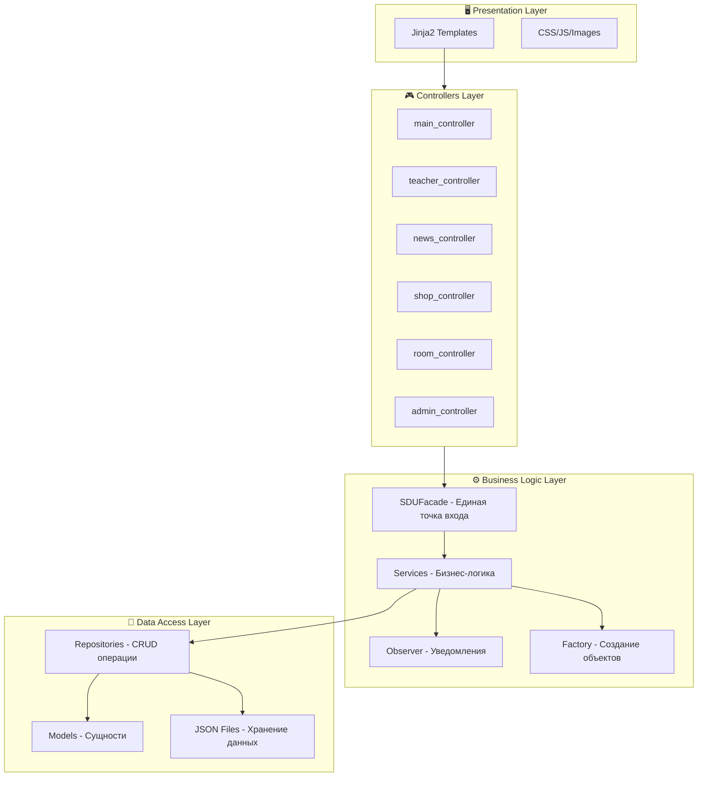
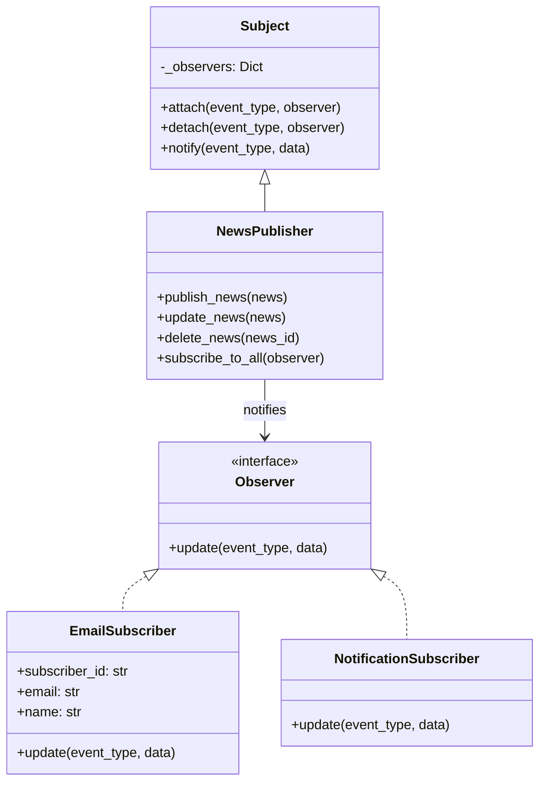
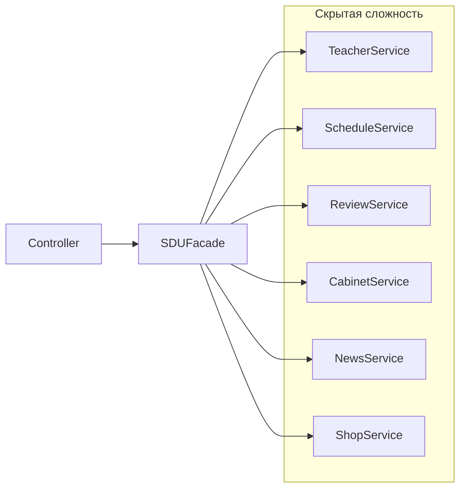

# 📚 SDU SuperApp — Полная документация проекта

**Веб-платформа для студентов и преподавателей SDU**

CSS 217 – Software Architecture and Design Patterns  
Final Project | 2025

---

## 📋 Содержание

1. [Общее описание](#общее-описание)
2. [Технологии](#технологии)
3. [Архитектура проекта](#архитектура-проекта)
4. [Паттерны проектирования](#паттерны-проектирования)
5. [Структура файлов](#структура-файлов)
6. [Слой моделей](#слой-моделей)
7. [Слой репозиториев](#слой-репозиториев)
8. [Слой сервисов](#слой-сервисов)
9. [Слой контроллеров](#слой-контроллеров)
10. [Функциональные модули](#функциональные-модули)
11. [SOLID принципы](#solid-принципы)
12. [Запуск приложения](#запуск-приложения)

---

## 🎯 Общее описание

SDU SuperApp — это комплексное веб-приложение для университета SDU, объединяющее несколько ключевых функций:

| Модуль | Описание |
|--------|----------|
| 👨‍🏫 **Преподаватели** | Рейтинг, отзывы, расписание преподавателей |
| 🚪 **Аудитории** | Поиск свободных аудиторий в реальном времени |
| 📰 **Новости** | Университетские новости с подпиской на уведомления |
| 🛒 **Магазин** | Мерч SDU с корзиной и оформлением заказов |
| ⚙️ **Админ-панель** | Управление контентом и модерация |

---

## 🛠 Технологии

```
Backend:       Python 3.11 + Flask 3.0
Frontend:      HTML5, CSS3, Jinja2
Хранение:      JSON-файлы (без базы данных)
Иконки:        Font Awesome 6
Шрифты:        Google Fonts (Inter)
i18n:          Поддержка ru/en/kz языков
Email:         Автоматические уведомления
Перевод:       deep-translator (автоперевод товаров и новостей)
```

---

## 🏗 Архитектура проекта

Проект использует **многослойную архитектуру** с четким разделением ответственности:



---

## 🎨 Паттерны проектирования

### 1. Factory Method (Порождающий паттерн)

**Расположение:** `factory/`

**Цель:** Определяет интерфейс для создания объектов, позволяя подклассам решать, какой класс инстанцировать.

```python
# factory/base_factory.py - Абстрактная фабрика
class BaseFactory(ABC):
    @abstractmethod
    def create(self, data: dict) -> Any:
        """Создает объект из словаря данных"""
        pass
    
    @abstractmethod
    def create_default(self) -> Any:
        """Создает объект с дефолтными значениями"""
        pass
```

**Конкретные фабрики:**
- `TeacherFactory` — создание преподавателей
- `NewsFactory` — создание новостей  
- `ProductFactory` — создание товаров
- `ReviewFactory` — создание отзывов

**Пример использования:**
```python
factory = TeacherFactory()
teacher = factory.create({
    'name': 'Иван Иванов',
    'department': 'Computer Science',
    'level': 'Professor'
})
```

---

### 2. Observer (Поведенческий паттерн)

**Расположение:** `observer/`

**Цель:** Определяет зависимость "один ко многим" между объектами. При изменении Subject все Observer уведомляются автоматически.



**Как это работает:**
1. Пользователь подписывается на новости (email)
2. Создается `EmailSubscriber` и регистрируется в `NewsPublisher`
3. При публикации новости все подписчики получают уведомление
4. `EmailSubscriber` отправляет email, `NotificationSubscriber` записывает в лог

```python
# Пример использования
publisher = NewsPublisher()
subscriber = EmailSubscriber(id="sub_1", email="user@email.com", name="User")
publisher.subscribe_to_all(subscriber)

# При публикации — все получат уведомление
publisher.publish_news(news)
```

---

### 3. Facade (Структурный паттерн)

**Расположение:** `facade/sdu_facade.py`

**Цель:** Предоставляет унифицированный интерфейс к набору интерфейсов в подсистеме, упрощая её использование.



**SDUFacade — единая точка входа:**
```python
class SDUFacade:
    """Singleton + Facade"""
    _instance = None
    
    def __init__(self):
        self._teacher_service = TeacherService()
        self._schedule_service = ScheduleService()
        self._review_service = ReviewService()
        self._cabinet_service = CabinetService()
        self._news_service = NewsService()
        self._shop_service = ShopService()
    
    # Комплексные операции
    def get_teacher_full_info(self, teacher_id):
        """Возвращает преподавателя + расписание + отзывы + рейтинг"""
        return {
            'teacher': self._teacher_service.get_teacher_by_id(teacher_id),
            'schedule': self._schedule_service.get_teacher_schedule(teacher_id),
            'reviews': self._review_service.get_teacher_reviews(teacher_id),
            'rating': self._review_service.get_teacher_rating(teacher_id)
        }
    
    def get_home_page_data(self):
        """Данные для главной страницы"""
        return {
            'top_teachers': self._teacher_service.get_top_rated_teachers(5),
            'latest_news': self._news_service.get_all_news(5),
            'products': self._shop_service.get_all_products()[:6]
        }
```

---

### 4. Singleton

Используется в нескольких классах для обеспечения единственного экземпляра:

- `SDUFacade` — единая точка входа к сервисам
- `NewsPublisher` — единый издатель новостей

```python
class SDUFacade:
    _instance = None
    
    def __new__(cls):
        if cls._instance is None:
            cls._instance = super().__new__(cls)
            cls._instance._initialized = False
        return cls._instance
```

---

## 📁 Структура файлов

```
SduSuperApp/
├── app.py                      # Главный файл Flask
├── config.py                   # Конфигурация приложения
├── requirements.txt            # Зависимости Python
│
├── models/                     # 📦 Модели данных (сущности)
│   ├── teacher.py              # Преподаватель
│   ├── schedule.py             # Расписание
│   ├── review.py               # Отзыв
│   ├── room.py                 # Аудитория
│   ├── news.py                 # Новость
│   ├── product.py              # Товар
│   ├── order.py                # Заказ
│   └── subscriber.py           # Email подписчик
│
├── repository/                 # 💾 Репозитории (доступ к данным)
│   ├── base_repository.py      # Базовый репозиторий
│   ├── teacher_repository.py
│   ├── schedule_repository.py
│   ├── review_repository.py
│   ├── room_repository.py
│   ├── news_repository.py
│   ├── product_repository.py
│   ├── order_repository.py
│   └── subscriber_repository.py
│
├── services/                   # ⚙️ Сервисы (бизнес-логика)
│   ├── teacher_service.py
│   ├── schedule_service.py
│   ├── review_service.py
│   ├── room_service.py
│   ├── news_service.py
│   ├── shop_service.py
│   ├── email_service.py        # Отправка email
│   └── translation_service.py  # Автоперевод контента
│
├── controllers/                # 🎮 Контроллеры (Flask Blueprints)
│   ├── main_controller.py      # /
│   ├── teacher_controller.py   # /teachers
│   ├── review_controller.py    # /reviews
│   ├── room_controller.py      # /rooms
│   ├── news_controller.py      # /news
│   ├── shop_controller.py      # /shop
│   ├── admin_controller.py     # /admin
│   └── language_controller.py  # /lang
│
├── factory/                    # 🏭 Factory Method паттерн
│   ├── base_factory.py
│   ├── teacher_factory.py
│   ├── news_factory.py
│   ├── product_factory.py
│   └── review_factory.py
│
├── observer/                   # 👀 Observer паттерн
│   ├── observer.py             # Абстрактный observer
│   ├── subject.py              # Абстрактный subject
│   ├── news_publisher.py       # Издатель новостей
│   ├── email_subscriber.py     # Email подписчик
│   └── notification_subscriber.py
│
├── facade/                     # 🎭 Facade паттерн
│   └── sdu_facade.py           # Единая точка входа
│
├── templates/                  # 🖼 HTML шаблоны (Jinja2)
│   ├── base.html               # Базовый шаблон
│   ├── index.html              # Главная страница
│   ├── teachers/               # Страницы преподавателей
│   ├── rooms/                  # Страницы аудиторий
│   ├── news/                   # Страницы новостей
│   ├── shop/                   # Страницы магазина
│   └── admin/                  # Админ-панель
│
├── static/                     # 📁 Статические файлы
│   └── style.css
│
├── data/                       # 📊 JSON-данные
│   ├── teachers.json
│   ├── schedules.json
│   ├── reviews.json
│   ├── rooms.json
│   ├── news.json
│   ├── products.json
│   ├── orders.json
│   └── subscribers.json
│
├── translations/               # 🌍 Файлы переводов (i18n)
│   ├── ru.json
│   ├── en.json
│   └── kz.json
│
└── utils/                      # 🔧 Утилиты
    └── i18n.py                 # Функции интернационализации
```

---

## 📦 Слой моделей

Модели представляют сущности предметной области с типизацией через dataclass:

### Teacher (Преподаватель)
```python
@dataclass
class Teacher:
    id: str
    name: str
    email: str
    department: str
    level: str              # Professor, Associate Professor, Senior Lecturer, Lecturer
    photo: str
    rating: float = 0.0
    reviews_count: int = 0
```

### News (Новость)
```python
@dataclass
class News:
    id: str
    title: str
    content: str
    category: str           # Учеба, Мероприятия, Спорт, Объявления
    author: str
    created_at: str
    image: str
    views: int = 0
    translations: Dict = field(default_factory=dict)  # Переводы на en/kz
```

### Product (Товар)
```python
@dataclass
class Product:
    id: str
    name: str
    description: str
    category: str
    price: float
    stock: int
    image: str
    is_available: bool = True
    translations: Dict = field(default_factory=dict)
```

### Order (Заказ)
```python
@dataclass
class Order:
    id: str
    customer_name: str
    customer_email: str
    items: List[Dict]       # [{'product_id', 'name', 'price', 'quantity'}]
    total_amount: float
    status: str             # Pending, Confirmed, Delivered, Cancelled
    created_at: str
    delivery_address: str
    language: str = 'ru'
```

---

## 💾 Слой репозиториев

Репозитории обеспечивают абстракцию доступа к данным (CRUD операции):

### BaseRepository — базовый класс
```python
class BaseRepository(ABC):
    def __init__(self, file_path: str, factory: BaseFactory):
        self._file_path = file_path
        self._factory = factory
    
    def get_all(self) -> List:
        """Получить все записи"""
        
    def get_by_id(self, id: str) -> Optional:
        """Получить по ID"""
        
    def create(self, item) -> Any:
        """Создать запись"""
        
    def update(self, item) -> Optional:
        """Обновить запись"""
        
    def delete(self, id: str) -> bool:
        """Удалить запись"""
```

Конкретные репозитории расширяют базовый:
- `TeacherRepository` — поиск, фильтрация по уровню
- `NewsRepository` — категории, популярные
- `ProductRepository` — категории, управление стоком
- `OrderRepository` — статусы, история клиента

---

## ⚙️ Слой сервисов

Сервисы содержат бизнес-логику приложения:

### ShopService — пример
```python
class ShopService:
    def __init__(self):
        self._product_repo = ProductRepository()
        self._order_repo = OrderRepository()
        self._factory = ProductFactory()
        self._translation_service = TranslationService()
    
    def create_order(self, customer_name, customer_email, cart_items, address, language):
        # 1. Валидируем корзину
        validation = self.validate_cart(cart_items)
        if not validation['valid']:
            return None
        
        # 2. Создаем заказ
        order = Order(...)
        created_order = self._order_repo.create(order)
        
        # 3. Уменьшаем stock товаров
        for item in cart_items:
            self._product_repo.decrease_stock(item['product_id'], item['quantity'])
        
        # 4. Отправляем email подтверждение
        email_service.send_order_confirmation(created_order)
        
        return created_order
```

### NewsService — работа с Observer
```python
class NewsService:
    def __init__(self):
        self._repository = NewsRepository()
        self._subscriber_repo = SubscriberRepository()
        self._publisher = NewsPublisher()  # Observer Pattern
    
    def subscribe(self, email, name, language='ru'):
        # Создаем подписчика
        subscriber = Subscriber(...)
        self._subscriber_repo.create(subscriber)
        
        # Создаем Observer и регистрируем
        observer = EmailSubscriber(subscriber.id, email, name, language)
        self._publisher.subscribe_to_all(observer)
        
        return True
    
    def create_news(self, title, content, category, author):
        news = self._factory.create({...})
        created = self._repository.create(news)
        
        # Уведомляем всех подписчиков
        self._publisher.publish_news(created)
        
        return created
```

---

## 🎮 Слой контроллеров

Контроллеры — это Flask Blueprints, обрабатывающие HTTP запросы:

```python
# controllers/shop_controller.py
from flask import Blueprint, render_template, request, jsonify, session
from facade.sdu_facade import SDUFacade

shop_bp = Blueprint('shop', __name__)

@shop_bp.route('/')
def shop_home():
    facade = SDUFacade()
    products = facade.get_products()
    categories = facade.get_product_categories()
    return render_template('shop/index.html', products=products, categories=categories)

@shop_bp.route('/cart')
def cart():
    cart_items = session.get('cart', [])
    facade = SDUFacade()
    total = facade.calculate_cart(cart_items)
    return render_template('shop/cart.html', cart=cart_items, total=total)

@shop_bp.route('/checkout', methods=['POST'])
def checkout():
    data = request.form
    facade = SDUFacade()
    order = facade.create_order(
        customer_name=data['name'],
        customer_email=data['email'],
        cart_items=session.get('cart', []),
        address=data.get('address', ''),
        language=session.get('language', 'ru')
    )
    session['cart'] = []  # Очищаем корзину
    return render_template('shop/order_success.html', order=order)
```

---

## 📱 Функциональные модули

### 1. Преподаватели (`/teachers`)

| Маршрут | Описание |
|---------|----------|
| `GET /teachers/` | Список преподавателей с фильтрацией |
| `GET /teachers/<id>` | Профиль преподавателя + расписание + отзывы |
| `POST /reviews/add` | Добавление отзыва (модерируется) |

**Поток данных:**
```
Controller → SDUFacade → TeacherService → TeacherRepository → teachers.json
                       → ScheduleService → ScheduleRepository → schedules.json
                       → ReviewService → ReviewRepository → reviews.json
```

### 2. Аудитории (`/rooms`)

| Маршрут | Описание |
|---------|----------|
| `GET /rooms/` | Главная страница аудиторий |
| `GET /rooms/free` | Свободные сейчас аудитории |
| `GET /rooms/search` | Поиск по дню/времени/корпусу |
| `GET /rooms/<id>` | Расписание аудитории |

### 3. Новости (`/news`)

| Маршрут | Описание |
|---------|----------|
| `GET /news/` | Лента новостей с категориями |
| `GET /news/<id>` | Страница новости (+views) |
| `POST /news/subscribe` | Подписка на email уведомления |

**Observer в действии:**
```
Пользователь подписывается → EmailSubscriber создается → NewsPublisher регистрирует
                                                                    ↓
Админ публикует новость → NewsPublisher.publish_news() → notify() → EmailSubscriber.update()
                                                                    ↓
                                                        Отправка email пользователю
```

### 4. Магазин (`/shop`)

| Маршрут | Описание |
|---------|----------|
| `GET /shop/` | Каталог товаров |
| `GET /shop/product/<id>` | Страница товара |
| `POST /shop/cart/add` | Добавить в корзину |
| `GET /shop/cart` | Просмотр корзины |
| `POST /shop/checkout` | Оформление заказа |

### 5. Админ-панель (`/admin`)

| Маршрут | Описание |
|---------|----------|
| `GET /admin/` | Дашборд со статистикой |
| `GET /admin/reviews` | Модерация отзывов |
| `GET /admin/orders` | Управление заказами |
| `GET /admin/teachers` | Управление преподавателями |
| `GET /admin/news` | Управление новостями |
| `GET /admin/products` | Управление товарами |
| `GET /admin/subscribers` | Список подписчиков |

---

## ⚖️ SOLID принципы

### S — Single Responsibility (Единственная ответственность)

| Компонент | Ответственность |
|-----------|-----------------|
| `Repository` | Только CRUD операции с данными |
| `Service` | Только бизнес-логика |
| `Controller` | Только обработка HTTP-запросов |
| `Factory` | Только создание объектов |
| `Observer` | Только получение уведомлений |

### O — Open/Closed (Открытость/Закрытость)

Классы открыты для расширения, закрыты для модификации:
- Новые фабрики наследуют `BaseFactory` без изменений базового класса
- Новые подписчики реализуют `Observer` без изменения `NewsPublisher`
- Новые репозитории расширяют `BaseRepository`

### L — Liskov Substitution (Подстановка Лисков)

Подклассы могут заменять базовые классы:
```python
# Любая фабрика работает одинаково
def create_items(factory: BaseFactory, data_list: list):
    return factory.create_many(data_list)

# Можно передать любую конкретную фабрику
create_items(TeacherFactory(), teachers_data)
create_items(NewsFactory(), news_data)
create_items(ProductFactory(), products_data)
```

### I — Interface Segregation (Разделение интерфейсов)

Маленькие специализированные интерфейсы:
- `Observer` — только метод `update(event_type, data)`
- `BaseFactory` — только `create()` и `create_default()`

### D — Dependency Inversion (Инверсия зависимостей)

Зависимость от абстракций:
```python
# Сервисы принимают репозитории через конструктор (Dependency Injection)
class ShopService:
    def __init__(self, 
                 product_repository: ProductRepository = None,
                 order_repository: OrderRepository = None):
        self._product_repo = product_repository or ProductRepository()
        self._order_repo = order_repository or OrderRepository()
```

---

## 🚀 Запуск приложения

### 1. Установка зависимостей

```bash
# Клонировать и перейти в директорию
cd SduSuperApp

# Создать виртуальное окружение
python -m venv .venv

# Активировать (macOS/Linux)
source .venv/bin/activate

# Установить зависимости
pip install -r requirements.txt

# Дополнительно для автоперевода
pip install deep-translator
```

### 2. Запуск

```bash
python app.py
```

Приложение будет доступно: **http://localhost:5001**

### 3. Структура URL

| URL | Модуль |
|-----|--------|
| `/` | Главная страница |
| `/teachers` | Преподаватели |
| `/rooms` | Аудитории |
| `/news` | Новости |
| `/shop` | Магазин |
| `/admin` | Админ-панель |
| `/lang/<code>` | Смена языка (ru/en/kz) |

---

## 🌍 Интернационализация (i18n)

Приложение поддерживает 3 языка: **русский**, **английский**, **казахский**.

**Как это работает:**
1. Переводы хранятся в `translations/{ru,en,kz}.json`
2. Middleware определяет язык из сессии или Accept-Language
3. Функция `t(key)` доступна во всех шаблонах
4. Товары и новости автоматически переводятся через `TranslationService`

```python
# В шаблоне Jinja2
{{ t('shop.add_to_cart') }}
{{ t('common.welcome', name=user_name) }}
```

---

## 📧 Email уведомления

`EmailService` отправляет автоматические письма:

| Событие | Получатель |
|---------|------------|
| Новый заказ | Покупатель |
| Заказ подтверждён | Покупатель |
| Заказ отменён | Покупатель |
| Новая новость | Подписчики (Observer) |

---

## ✅ Заключение

SDU SuperApp демонстрирует применение:

- **3 паттернов проектирования**: Factory Method, Observer, Facade (+ Singleton)
- **Все 5 SOLID принципов** в архитектуре
- **Многослойная архитектура**: Models → Repositories → Services → Controllers → Templates
- **Чистое разделение ответственности** между компонентами

Проект создан в рамках курса **CSS 217 – Software Architecture and Design Patterns**.

---

© 2025 SDU University | Developer: Daniyal Bazarbek
